# Almowakeb Target Architecture Blueprint

Status: Phase 2 architecture blueprint  
Scope: Technical architecture and implementation blueprint only  
Code status: No production code changes in this phase

## 1. Purpose

This document turns the approved Phase 1 analysis into a long-term target architecture for Almowakeb as a modular business platform that can evolve into Accounting ERP, Retail, Pharmacy, Warehouse, Delivery, Restaurant, and future variants without forking the whole codebase.

This blueprint uses:

- the current repository as the primary source of truth;
- the approved Phase 1 architecture analysis;
- current implemented foundations such as the Rust domain/application layering, Tauri adapter, company lifecycle gating, accounting model, and shared types package.

Repository anchors used while preparing this blueprint include:

- `apps/desktop/src/App.tsx`
- `apps/desktop/src/app/router/ErpRoutes.tsx`
- `apps/desktop/src/app/providers/TabProvider.tsx`
- `apps/desktop/src/app/shell/AppLayout.tsx`
- `apps/desktop/src/app/shell/routeRegistry.ts`
- `apps/desktop/src/modules/opening-balance/lib/company-lifecycle.ts`
- `crates/domain`
- `crates/application`
- `crates/infrastructure`
- `crates/tauri-adapter`
- `docs/accounting-model.md`
- `docs/company-lifecycle-audit.md`
- `docs/postlock-equity-audit.md`

## 2. Design Goals

1. Preserve accounting correctness and auditability.
2. Separate business truth from UI-specific calculations.
3. Support multiple product editions from one codebase.
4. Separate navigation state from visual presentation.
5. Keep all future voice, search, barcode, and publishing flows behind the same application/domain rules used by the normal UI.
6. Stay compatible with the current Rust + React + Tauri architecture instead of introducing a rewrite-first plan.

## 3. Architectural Principles

- Clean dependency direction: UI and adapters depend inward, never the reverse.
- Domain rules are authoritative.
- Application services orchestrate use cases and transactions.
- Infrastructure implements ports and operational concerns.
- Reports consume accounting projections, not independent business logic.
- Platform capabilities are configuration- and policy-driven, not fork-driven.
- CQRS is used only for read models that materially improve correctness, extensibility, or performance.
- Events are introduced only where they help decouple projections, audit, and integrations.

## 4. Target Architecture Diagram

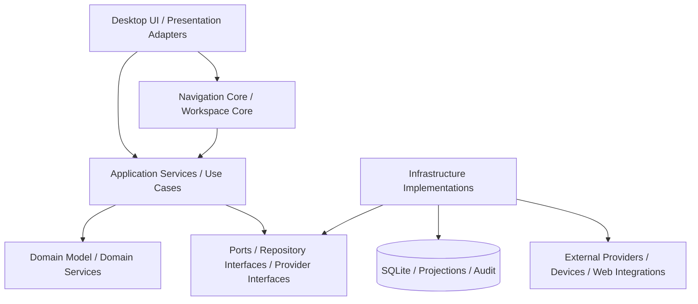

## 5. Frontend Architecture Diagram

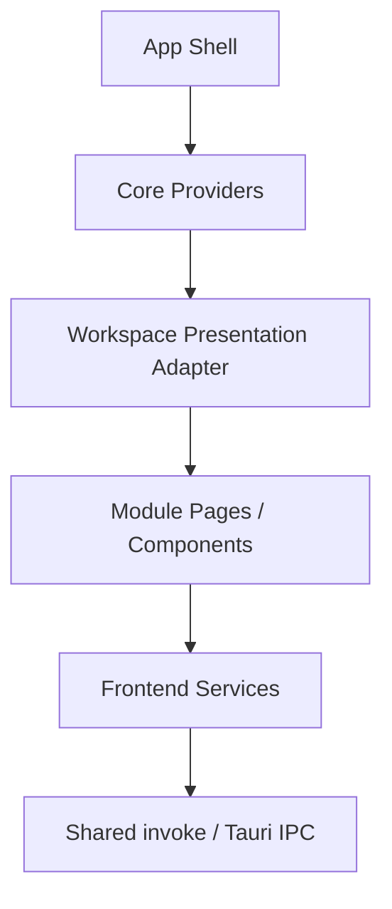

## 6. Backend Architecture Diagram

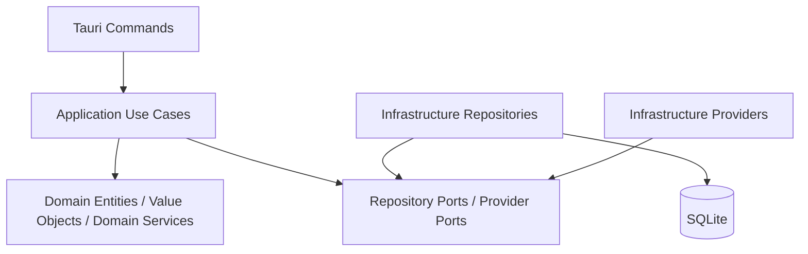

## 7. Dependency Graph

```text
apps/desktop
  -> packages/shared-types
  -> crates/tauri-adapter command surface through IPC

crates/tauri-adapter
  -> crates/application
  -> crates/infrastructure
  -> crates/domain

crates/application
  -> crates/domain

crates/infrastructure
  -> crates/application ports
  -> crates/domain

crates/domain
  -> no business-layer dependency on UI or infrastructure
```

Target dependency rule:

```text
presentation -> application -> domain
infrastructure -> application ports + domain
integrations -> application ports
```

## 8. Bounded Context / Domain Map

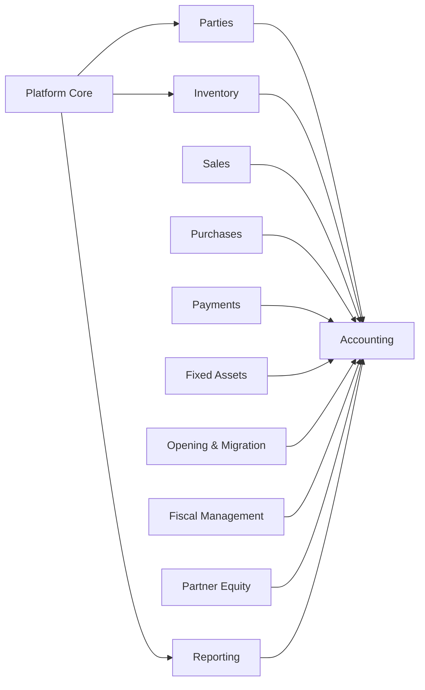

### Contexts

- Core domain:
  - Accounting
  - Fiscal Management
  - Opening & Migration
  - Inventory Valuation
  - Partner Equity
- Supporting business domains:
  - Parties
  - Sales
  - Purchases
  - Payments
  - Fixed Assets
  - Production
- Platform services:
  - Authorization
  - Navigation / Workspace
  - Search
  - Localization
  - Terminology
  - Appearance
  - Device Input
  - Audit
  - Configuration
  - Publishing

## 9. Platform Core Map

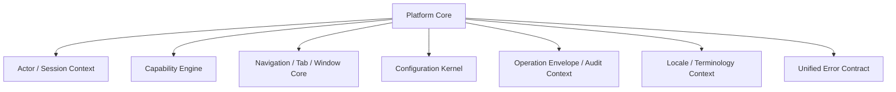

### Platform Core Responsibilities

- actor/session context
- permission evaluation input
- edition/capability resolution
- workspace item lifecycle
- operation correlation and audit metadata
- configuration lookup
- localized label resolution at presentation time

## 10. Shared Kernel

The shared kernel is intentionally small and stable.

### Shared primitives

- `EntityId`
- `DocumentId`
- `ModuleId`
- `RouteId`
- `WorkspaceItemId`
- `WindowId`
- `CurrencyCode`
- `LanguageCode`
- `TerminologyKey`
- `CapabilityKey`
- `PermissionKey`
- `CorrelationId`
- `FiscalYearId`
- `FiscalPeriodId`
- `MonetaryAmount` and money snapshots
- date/time and accounting period ranges

### Shared value objects

- `MoneySnapshot`
- `ExchangeRateSnapshot`
- `DateRange`
- `AccountingDate`
- `ActorRef`
- `PermissionGrant`
- `LocalizedLabelRef`
- `NavigationTargetRef`
- `SearchResultRef`

## 11. Business Module Map

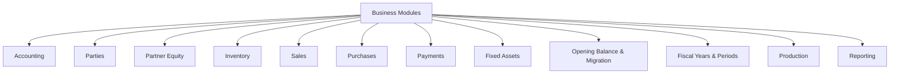

### Module boundary rules

- Modules may call other modules only through application services or published read models.
- Cross-module accounting effects must resolve into journals, projections, or explicit accounting services.
- UI modules must not recreate domain semantics that already exist in Rust.

## 12. Service Map

### Application services

- Account management
- Journal posting/reversal
- Ledger and projection queries
- Opening migration orchestration
- Fiscal year close/reopen workflow
- Partner equity computation
- Inventory transaction posting
- Fixed asset lifecycle posting
- Search orchestration
- Voice command orchestration
- Publishing orchestration

### Domain services

- balance classification
- posting validation
- fiscal close validation
- carry-forward policy
- retained earnings transfer policy
- partner profit allocation policy
- inventory valuation policy
- depreciation policy
- barcode normalization rules
- voice command safety policy

## 13. Integration Map

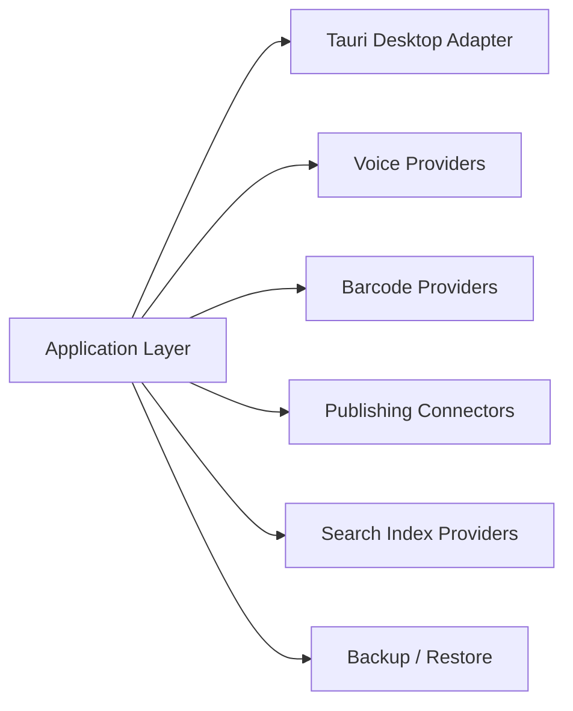

Integration adapters do not own business rules. They only translate transport and provider details.

## 14. Navigation Architecture

Decision: one navigation core, many presentation adapters.

### Core navigation model

`NavigationNode`

- `id`
- `routeId`
- `moduleId`
- `entityType`
- `entityId`
- `titleKey`
- `iconKey`
- `state`
- `closable`
- `dirty`
- `restoreToken`
- `requiredPermissions`
- `context`
- `parentId`
- `presentationMode`

`NavigationIntent`

- `OpenRoute`
- `OpenEntity`
- `OpenReport`
- `OpenSettings`
- `FocusExisting`
- `OpenInNewTab`
- `OpenInNewWindow`
- `TransferToWindow`

`NavigationContext`

- actor
- company lifecycle state
- edition profile
- module capabilities
- route arguments
- entity metadata

### Navigation flow

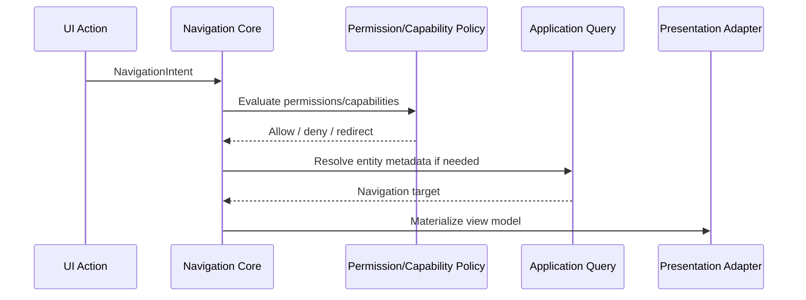

### Why

- Current route-based tabs are too tightly coupled to one shell style.
- Future multi-window and workspace restore need a stable, presentation-independent navigation identity.

## 15. Tab Architecture

Decision: tabs are workspace items, not routes.

### Tab model

`WorkspaceItem`

- `workspaceItemId`
- `navigationNodeId`
- `kind` (`page`, `entity`, `report`, `settings`, `tool`)
- `viewState`
- `dirtyState`
- `restoreState`
- `pinned`
- `closable`
- `active`
- `windowId`

### Presentation adapters

- Default tab bar adapter
- Browser-like tab adapter
- VS Code-like editor/group adapter

All three consume the same workspace state and render it differently.

### Rejected alternative

Three separate tab systems.

Why rejected:

- duplicates restore logic;
- duplicates dirty-state protection;
- makes permission and navigation behavior diverge;
- increases migration cost dramatically.

## 16. Window Architecture

Decision: windows host workspace containers; tabs can move between them.

### Window model

`WindowWorkspace`

- `windowId`
- `mode` (`single`, `detached`)
- `items`
- `activeItemId`
- `layoutPreset`
- `permissionsSnapshot`
- `restoreToken`
- `lifecycleState`

### Window lifecycle

1. Create window shell.
2. Load workspace container.
3. Attach workspace items.
4. Evaluate permissions and edition capabilities.
5. Guard close if dirty items exist.
6. Persist restore state.
7. Dispose only after explicit safe close.

### Supported scenarios

- single-window default
- detached document window
- open entity in new window
- move tab to window
- restore prior windows on startup

### Tauri 2 role

Tauri manages native window creation and lifecycle; the application owns window intent, permissions, restore rules, and dirty-state policy.

## 17. Global Search Architecture

Decision: backend-backed normalized search with navigation metadata.

### Search result model

- `resultId`
- `entityType`
- `entityId`
- `moduleId`
- `title`
- `subtitle`
- `keywords`
- `badge`
- `destination`
- `requiredPermissions`
- `capabilities`
- `score`

### Search pipeline


### Provider contract

Each module can publish:

- searchable projection;
- keywords;
- destination metadata;
- permission/capability requirements.

### Why

Current global search UI exists but does not yet have an authoritative search engine.

## 18. Voice Architecture

Decision: provider-independent voice pipeline that terminates in normal application commands.

### Voice pipeline

```mermaid
flowchart LR
    Mic[Speech Input]
    STT[Speech to Text Provider]
    Intent[Intent Detection]
    Normalize[Command Normalization]
    Validate[Validation / Permission / Capability]
    Confirm[Confirmation Policy]
    Execute[Application Command]
    Domain[Domain Rules]
    Result[Result + User Feedback + Audit]

    Mic --> STT --> Intent --> Normalize --> Validate --> Confirm --> Execute --> Domain --> Result
```

### Voice intent model

- `intentType`
- `language`
- `rawTranscript`
- `normalizedTranscript`
- `candidateCommands`
- `confidence`
- `ambiguityLevel`
- `targetEntities`
- `requiresConfirmation`

### Voice command model

- `commandType`
- `arguments`
- `origin = voice`
- `actor`
- `language`
- `confidence`
- `correlationId`

### Confirmation policy

Require confirmation for:

- posting transactions
- deleting records
- closing periods/fiscal years
- changing opening balances
- distribution/profit allocation
- high-value or irreversible operations

### Undo / rollback strategy

- Prefer compensating application commands over direct database rollback after user-visible success.
- If execution is still inside a transaction boundary and not committed, fail atomically.
- After commit, only approved reversal/cancellation flows may undo the action.

## 19. Barcode Architecture

Decision: device-independent scanner abstraction.

### Barcode provider model

`BarcodeScanEvent`

- `rawValue`
- `normalizedValue`
- `sourceType` (`camera`, `usb`, `bluetooth`, `keyboard`, `native`, `mobile`)
- `deviceId`
- `timestamp`
- `confidence`

### Barcode service model

- scanner session control
- debounce/duplicate handling
- format normalization
- target form integration

### Flow

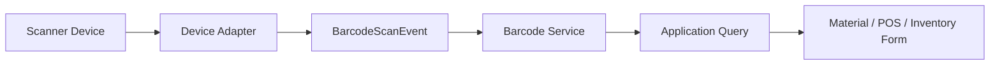

### Why

Forms such as material creation must consume a scanner abstraction, not camera-specific logic.

## 20. Localization Architecture

Decision: namespace-based i18n with formatter services and terminology overlay.

### i18n layers

1. base translation keys
2. locale pack by namespace
3. terminology override layer
4. runtime formatter layer

### Namespaces

- `shell`
- `navigation`
- `accounting`
- `inventory`
- `partners`
- `reports`
- `settings`
- `errors`
- `validation`
- `voice`
- `search`

### Localization model

- `TranslationKey`
- `Namespace`
- `Locale`
- `DefaultMessage`
- `PluralRule`
- `FormatHint`

### Rules

- translation keys never become business identifiers;
- business logic never depends on translated text;
- errors and validation messages are localized at presentation/application boundary;
- Arabic RTL and English LTR are first-class;
- future languages follow the same namespace system.

## 21. Theme / Configuration Architecture

Decision: design tokens + appearance profiles + runtime configuration.

### Theme model

- color tokens
- typography tokens
- spacing tokens
- density
- border radius
- elevation
- data table density
- shell layout preset

### Configuration layers

1. system defaults
2. edition defaults
3. company settings
4. user preferences
5. temporary workspace/session overrides

### Why

The current app already has appearance and settings foundations. The target design keeps them but formalizes precedence and scope.

## 22. Custom Terminology Architecture

Decision: controlled terminology overrides, never domain identifier mutation.

### Terminology record

- `terminologyKey`
- `language`
- `defaultLabel`
- `overrideLabel`
- `scope` (`system`, `edition`, `company`, `user`)
- `moduleId`

### Resolution order

1. user override
2. company override
3. edition preset
4. default translation

### Examples

- "Customers" -> "Patients" in Pharmacy edition
- "Materials" -> "Items" in Retail
- "Partners" -> "Owners" in some accounting setups

Internal identifiers remain unchanged.

## 23. Feature Capability Model

Decision: capability engine combines lifecycle, edition, permissions, and environment.

### Capability dimensions

- company lifecycle capability
- edition capability
- module capability
- environment capability
- user permission

### Final rule

An operation is allowed only when all relevant layers allow it.

```text
Allowed = lifecycle AND edition AND module AND permission AND environment
```

### Why

The current lifecycle gating is already useful. The target architecture generalizes it rather than replacing it.

## 24. Product Edition Architecture

Decision: edition profiles configure modules, capabilities, terminology, defaults, and navigation.

### Edition profile

- `editionId`
- `enabledModules`
- `enabledCapabilities`
- `defaultNavigation`
- `terminologyPreset`
- `workflowPreset`
- `themePreset`
- `integrationPreset`

### Example editions

- Accounting
- Retail
- Pharmacy
- Warehouse
- Restaurant
- Delivery

### Rejected alternative

Separate codebases per business type.

Why rejected:

- duplicated fixes;
- fragmented accounting logic;
- incompatible future integrations;
- much higher maintenance cost.

## 25. Publishing / Integration Architecture

Decision: publishing is an outbound integration layer, never core ERP truth.

### Publishing flow

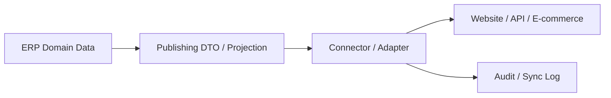

### Connector responsibilities

- data mapping
- transport/authentication
- retry policy
- sync status
- external identity mapping

### ERP responsibilities

- authoritative source data
- publishing eligibility rules
- audit trail
- user permissions

## 26. Accounting Architecture

Decision: separate accounting facts, projections, analytics, and presentation.

### Accounting layers

1. Accounting facts
   - posted journal entries
   - posted journal lines
   - historical money snapshots
2. Accounting projections
   - account balance projection
   - partner current balance projection
   - retained earnings projection
   - inventory valuation projection
   - fixed asset carrying value projection
3. Analytical calculations
   - ratio analysis
   - trend analysis
   - performance metrics
4. Presentation calculations
   - table totals
   - display-side grouping
   - localized formatters

### Core accounting rule

```text
Posted Journal Lines
  -> Accounting Projections
  -> Domain-Specific Read Models
  -> Reports
  -> UI
```

### Target accounting components

- Chart of Accounts service
- Journal posting/reversal service
- Account balance projection service
- Financial period service
- Fiscal year service
- Opening/cutover service
- Equity allocation service
- Inventory accounting service
- Fixed asset accounting service
- Report projection service

### Source-of-truth decision

Account balances should move toward authoritative projections derived from posted journal lines, not persisted ad hoc balance fields as the primary UI truth.

## 27. Partner / Equity Architecture

Decision: model registered capital, current account, drawings, retained earnings allocation, and total equity explicitly.

### Partner equity components

- Partner master record
- Capital account
- Current account
- Drawings account
- Profit-sharing agreement
- Allocation history
- Equity statement projection

### Fixed-capital policy

Under the fixed-capital model:

- capital changes only through explicit capital transactions;
- current-account movements do not mutate registered capital;
- drawings reduce partner equity but do not reduce registered capital;
- current-year profit share flows into the current account unless explicitly capitalized.

### Partner report derivation

Partner statements derive from:

- posted journal lines for linked capital/current/drawings accounts;
- approved allocation records;
- explicit capitalization journals;
- carry-forward balances after fiscal close.

## 28. Fiscal-Year Architecture

Decision: introduce a first-class fiscal year aggregate over fiscal periods.

### Fiscal year components

- `FiscalYear`
- opening period
- operational periods
- year status
- close package
- carry-forward package
- reopen/correction policy

### Year states

- `Draft`
- `Open`
- `Closing`
- `Closed`
- `RolledForward`
- `Reopened`

### Fiscal year close flow

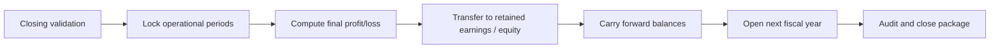

### Carry-forward scope

- balance sheet account balances
- partner current/equity balances
- retained earnings
- inventory opening quantities/valuation
- fixed asset carrying values and depreciation state

### Correction policy

- reopening is explicit and audited;
- reopening after published close requires elevated permission;
- reopening creates a correction record, never silent mutation.

## 29. Conceptual Database Model

Decision: preserve aggregate integrity and auditability over theoretical purity.

### Entity groups

- configuration and company settings
- users, roles, permissions
- accounts and account metadata
- journal entries and journal lines
- fiscal years and fiscal periods
- opening migration aggregates
- parties and partner-equity links
- inventory masters and stock movements
- fixed assets and asset events
- projections and search indexes
- audit records and sync logs
- terminology and localization overrides
- workspace/window restore state

### Key relationships

- partner -> linked capital/current/drawings accounts
- journal entry -> journal lines
- fiscal year -> fiscal periods
- opening migration -> opening lines / reconciliation / status
- inventory documents -> stock movements -> accounting impact
- fixed asset events -> journal impact
- search projection -> destination metadata
- publishing sync -> source entity + external target

### Constraints

- journal balance integrity
- unique idempotency keys where needed
- immutable posted accounting facts
- valid fiscal period overlap rules
- valid capability/edition references
- unique terminology key by scope + language

### Index guidance

- journal lines by account/date/status
- document source idempotency
- stock movements by material/warehouse/date
- partner linked accounts
- fiscal year/period date lookup
- search text lookup tables
- audit by actor/date/action

## 30. Transaction Boundaries

Decision: transaction boundaries live in application use cases, not UI or adapter code.

### Transaction categories

- master-data with linked accounting accounts
- financial posting
- opening migration phase transitions
- fiscal close / carry-forward
- publishing job state update
- terminology/configuration updates
- workspace restore persistence

### Rules

- a business use case commits all related state or none;
- UI actions must never simulate partial success;
- integration side effects happen after the business commit or through an outbox-like integration log;
- projections may be updated synchronously or asynchronously depending on criticality, but authoritative facts commit first.

## 31. Repository and Port Interfaces

### Repository ports

- account repository
- journal entry repository
- journal projection repository
- fiscal year repository
- fiscal period repository
- opening migration repository
- partner repository
- inventory repositories
- fixed asset repository
- search projection repository
- terminology repository
- workspace state repository
- audit repository
- publishing sync repository

### Provider ports

- exchange rate provider
- voice STT provider
- voice intent provider
- barcode provider
- search provider
- publishing connector provider
- notification provider

## 32. Error-Handling Strategy

Decision: one layered error model with stable categories.

### Error categories

- validation
- conflict
- not found
- permission denied
- capability denied
- lifecycle blocked
- accounting rule violation
- integration failure
- infrastructure failure
- unexpected internal failure

### Error contract

- stable code
- message key
- localized fallback message
- severity
- correlation id
- retry hint
- field errors where relevant

### Why

This keeps Rust errors structured while allowing React/Tauri UI to present localized, consistent feedback.

## 33. Security and Permission Model

Decision: permissions are enforced at three levels, with application enforcement being mandatory.

### Levels

1. UI visibility and affordance
2. navigation/workspace access
3. application command/query authorization

### Permission model

- `PermissionKey`
- `Role`
- `RoleGrant`
- `ActorPermissionSnapshot`
- `CapabilityRequirement`

### Rules

- UI hiding alone is never sufficient;
- Tauri commands do not imply trust;
- window and tab access also re-evaluate permission/capability context;
- voice and search results must honor the same permission engine.

## 34. Audit Architecture

Decision: every important operation produces structured audit metadata.

### Audit record

- `auditId`
- `actor`
- `origin` (`ui`, `voice`, `import`, `integration`, `system`)
- `action`
- `entityType`
- `entityId`
- `beforeRef`
- `afterRef`
- `correlationId`
- `timestamp`
- `result`

### Audited operations

- financial posting/reversal
- opening migration lifecycle changes
- fiscal close/reopen
- capability and edition changes
- permission/role changes
- terminology/configuration changes
- publishing operations
- voice-executed commands

## 35. Testing Architecture

### Test layers

- domain invariant tests
- application use-case tests
- infrastructure repository tests
- projection consistency tests
- integration adapter contract tests
- desktop navigation/workspace tests
- end-to-end accounting scenario tests

### High-priority suites

- account balance projection consistency
- fiscal year closing and carry-forward
- partner equity reconciliation
- inventory valuation reconciliation
- navigation/tab/window restore and dirty-state
- permission enforcement across UI and commands
- voice confirmation and denial paths
- barcode provider normalization

## 36. Migration Strategy

Decision: incremental migration, no big-bang rewrite.

### Migration phases

1. stabilize accounting source of truth
2. introduce projection/read-model layer for critical reports
3. introduce permission engine enforcement at application level
4. extract navigation/workspace core from current route-coupled tabs
5. add terminology + i18n namespace layer
6. add search registry and projections
7. add barcode and voice abstractions
8. add fiscal year aggregate and carry-forward engine
9. add edition profile system
10. add publishing connectors

### Data migration posture

- preserve existing facts;
- add new projections beside existing flows first;
- cut over readers gradually;
- keep backward-compatible adapters during transition.

## 37. Implementation Roadmap

### Phase A: correctness foundations

- authoritative account balance projection
- report projection boundary
- permission enforcement completion
- audit envelope completion

### Phase B: platform core

- navigation core
- workspace/tab/window model
- restore-state persistence
- terminology + i18n foundation

### Phase C: business architecture expansion

- fiscal year aggregate
- close/roll-forward engine
- partner equity package
- production architecture consolidation

### Phase D: platform capabilities

- search engine and registry
- barcode abstraction
- voice orchestration
- edition profiles

### Phase E: integrations

- publishing projections
- connector framework
- external sync / webhook / REST exposure

## 38. Major Architecture Decisions

### Decision 1: One navigation core, multiple presentation adapters

- Decision: unify route/entity/report/settings navigation behind one core.
- Why: current route-bound tabs cannot support browser-like, VS Code-like, and multi-window behavior cleanly.
- Alternatives considered: keep route-based tabs and patch multi-window later.
- Why rejected: restore state, dirty-state, and permissions would fragment.
- Migration impact: moderate frontend refactor with strong long-term payoff.

### Decision 2: Account balances come from accounting projections

- Decision: move toward posted-ledger-derived account balance projections as primary truth.
- Why: current analysis identified a conflict between persisted account balances and report/ledger truth.
- Alternatives considered: keep both and reconcile ad hoc in UI.
- Why rejected: permanent drift and duplicated logic.
- Migration impact: backend projection work and report cutover.

### Decision 3: Fiscal year becomes a first-class aggregate

- Decision: add a fiscal year model above current fiscal periods.
- Why: period closing alone is not enough for retained earnings transfer, carry-forward, and next-year opening.
- Alternatives considered: use only periods with conventions.
- Why rejected: insufficient for controlled year-close workflows.
- Migration impact: moderate backend modeling and UX workflow additions.

### Decision 4: Fixed-capital partner model remains explicit

- Decision: preserve explicit separation of capital, current account, drawings, and profit allocation.
- Why: this matches implemented accounting documentation and prevents capital drift from daily current-account movements.
- Alternatives considered: collapsing partner equity into one balance.
- Why rejected: loses accounting meaning and auditability.
- Migration impact: low; mostly consolidation and projection improvements.

### Decision 5: Voice executes application commands only

- Decision: voice can only normalize into standard application commands.
- Why: avoids bypassing validation, permissions, and audit.
- Alternatives considered: direct database automation or UI macro style automation.
- Why rejected: unsafe and unauditable.
- Migration impact: low on core accounting, medium on orchestration.

### Decision 6: Product variants use edition profiles, not forks

- Decision: business variants are capability/module/configuration profiles.
- Why: preserves a shared accounting and platform core.
- Alternatives considered: separate projects per variant.
- Why rejected: duplicated maintenance and inconsistent business rules.
- Migration impact: moderate configuration architecture work, low domain risk.

### Decision 7: Reports consume projections, not frontend business logic

- Decision: move critical report semantics behind backend read models/projections.
- Why: current frontend report helpers already hold too much accounting logic.
- Alternatives considered: keep improving frontend helpers.
- Why rejected: wrong dependency direction for a financial system.
- Migration impact: medium backend work with high correctness benefit.

### Decision 8: Controlled terminology overlay

- Decision: allow label overrides through terminology keys and localized overlays.
- Why: supports editions and customer language preferences without mutating internal identifiers.
- Alternatives considered: hardcoded label forks.
- Why rejected: brittle and unscalable.
- Migration impact: moderate UI text extraction effort.

### Decision 9: Barcode is a platform service, not a form feature

- Decision: barcode input sits behind provider adapters and normalized scan events.
- Why: multiple devices and future mobile/native scenarios require abstraction.
- Alternatives considered: camera-only implementation.
- Why rejected: cannot scale to USB/Bluetooth/keyboard wedge workflows.
- Migration impact: low initial core work, high reuse payoff.

### Decision 10: Publishing is outbound integration only

- Decision: websites and external channels consume mapped projections, not ERP tables directly.
- Why: prevents website coupling from contaminating ERP core.
- Alternatives considered: expose ERP tables or business entities directly.
- Why rejected: high coupling and poor upgrade safety.
- Migration impact: low on existing core, moderate for connector framework.

## 39. Recommended Next Implementation Slice

The first approved implementation slice should be:

1. authoritative account balance projection;
2. critical report projection boundary;
3. application-level permission enforcement completion;
4. navigation/workspace core design spike;
5. minimal i18n + terminology extraction plan.

This order reduces architectural risk before adding voice, multi-window, search, or publishing.

## 40. Explicit Non-Goals for This Phase

- no production feature implementation;
- no migration files yet;
- no UI redesign;
- no database rewrite;
- no parallel navigation systems;
- no direct voice/database automation;
- no product-fork strategy.
