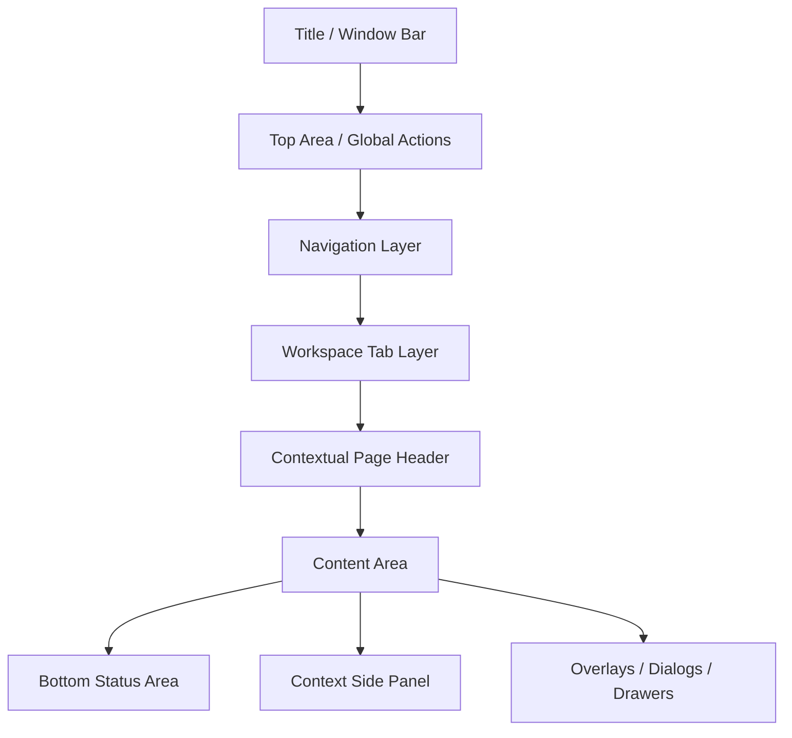

# Almowakeb UI/UX Architecture Blueprint

Status: Phase 3 UI/UX architecture blueprint  
Scope: Platform UI/UX system and reusable design architecture only  
Code status: No frontend implementation in this phase

## 1. Purpose

This document turns:

1. the approved business analysis from Phase 1,
2. the approved technical architecture from Phase 2,
3. the actual current UI implementation in the repository

into a complete future UI/UX architecture for Almowakeb as a reusable ERP platform design system.

This blueprint is grounded in the current repository, especially:

- `apps/desktop/src/App.tsx`
- `apps/desktop/src/app/shell/AppLayout.tsx`
- `apps/desktop/src/app/shell/Sidebar.tsx`
- `apps/desktop/src/app/shell/TopBar.tsx`
- `apps/desktop/src/app/shell/TabBar.tsx`
- `apps/desktop/src/app/shell/layouts/*`
- `apps/desktop/src/app/providers/AppearanceProvider.tsx`
- `apps/desktop/src/app/providers/TabProvider.tsx`
- `apps/desktop/src/app/providers/TableSettingsProvider.tsx`
- `apps/desktop/src/app/providers/SidePanelSettingsProvider.tsx`
- `apps/desktop/src/app/providers/NavSidebarSettingsProvider.tsx`
- `apps/desktop/src/shared/config/themeRegistry.ts`
- `apps/desktop/src/shared/types/appearance.ts`
- `apps/desktop/src/widgets/form-shell/FormPanel.tsx`
- `apps/desktop/src/widgets/sidebar-shell/*`
- `apps/desktop/src/widgets/table-shell/*`
- `apps/desktop/src/shared/ui/*`
- `apps/desktop/src/modules/core/settings/*`
- `apps/desktop/src/modules/accounting/chart-of-accounts/pages/accounting.tsx`
- `apps/desktop/src/widgets/tree-sidebar/TreeItem.tsx`
- `apps/desktop/src/app/shell/GlobalSearch.tsx`

The current UI already contains strong foundations:

- reusable shell layouts,
- appearance settings,
- table settings,
- side-panel settings,
- shared Radix/shadcn-based primitives,
- Arabic-first direction,
- tabbed navigation,
- tree/detail-panel workflows.

This blueprint preserves those strengths and organizes them into a stable platform UX system.

## 2. Design Principles

### 2.1 Core principles

1. **Arabic-first, not Arabic-only**  
   RTL is the default mental model, but the system must remain localization-safe for English and future languages.

2. **Predictable before impressive**  
   ERP users care more about trust, consistency, and speed than novelty.

3. **One interaction model, multiple presentations**  
   Default tabs, browser mode, and VS Code mode must share one navigation/workspace core.

4. **Progressive complexity**  
   Beginners should see simple actions first; experts should gain shortcuts, density, quick-open, and multi-window power.

5. **Accounting clarity over decorative UI**  
   Labels, report states, currency display, and destructive actions must communicate meaning precisely.

6. **Panels over page churn**  
   Detail, edit, and create workflows should reuse a consistent side-panel/drawer model where appropriate.

7. **State visibility**  
   Users should always understand where they are, what period they are in, what currency context is active, and whether there are unsaved changes.

8. **Accessibility is a core requirement**  
   Keyboard, focus, semantics, contrast, scalable text, and reduced motion must be designed from the beginning.

9. **Configurable, but controlled**  
   Themes, density, layout, terminology, and tab style can change without breaking module consistency.

10. **Platform-first reuse**  
   Individual screens must consume system patterns rather than invent local UI behaviors.

## 3. Design Tokens

Decision: define all UI values as reusable tokens that map cleanly to the existing appearance/table/panel settings system.

### 3.1 Token layers

1. **Foundation tokens**
   - color
   - typography
   - spacing
   - radius
   - shadow/elevation
   - border
   - motion
   - z-index

2. **Semantic tokens**
   - surface
   - interactive
   - focus
   - success
   - warning
   - danger
   - info
   - muted
   - sidebar
   - panel
   - table

3. **Component tokens**
   - button heights
   - input heights
   - row height
   - panel width
   - tab height
   - icon size
   - touch target size

### 3.2 Typography tokens

- `font.family.ui.ar`: Arabic-first UI font stack
- `font.family.ui.latn`: Latin UI font stack
- `font.family.mono`: tabular numeric stack
- `font.size.xs`: metadata, helper text
- `font.size.sm`: standard control label
- `font.size.md`: standard body
- `font.size.lg`: section title
- `font.size.xl`: page title
- `font.weight.medium`
- `font.weight.bold`
- `font.weight.black`
- `font.line.tight`
- `font.line.normal`
- `font.tracking.normal`
- `font.tracking.tight`

### 3.3 Spacing tokens

- `space.1`: 4px
- `space.2`: 8px
- `space.3`: 12px
- `space.4`: 16px
- `space.5`: 20px
- `space.6`: 24px
- `space.8`: 32px
- `space.10`: 40px
- `space.12`: 48px

### 3.4 Density tokens

Match the current density model already present in:

- `AppearanceProvider`
- `TableSettingsProvider`
- `SidePanelSettingsProvider`

Density profiles:

- `compact`
- `comfortable`
- `spacious`

Each density changes:

- control height
- row height
- vertical padding
- panel spacing
- label size
- content gaps

### 3.5 Radius tokens

- `radius.sm`
- `radius.md`
- `radius.lg`
- `radius.xl`
- `radius.pill`

### 3.6 Elevation tokens

- `elevation.0`
- `elevation.1`
- `elevation.2`
- `elevation.3`
- `elevation.overlay`

### 3.7 Border tokens

- `border.subtle`
- `border.default`
- `border.strong`
- `border.focus`
- `border.danger`

### 3.8 Icon tokens

- `icon.xs`
- `icon.sm`
- `icon.md`
- `icon.lg`
- semantic icon families:
  - navigation
  - accounting
  - actions
  - states
  - warnings

### 3.9 Motion tokens

- `motion.fast`
- `motion.normal`
- `motion.slow`
- `motion.reduced = minimal`

Rule: motion must support reduced-motion mode and must never carry meaning by itself.

## 4. Global Application Shell

Decision: the shell is a configurable presentation frame around one shared navigation/workspace core.

### 4.1 Shell zones

### 4.2 Shell components

- Title/window bar
- Global top bar
- Primary navigation surface
- Workspace/tab surface
- Page header surface
- Main content canvas
- Context side panel
- Dialog/overlay layer
- Bottom status layer

### 4.3 Shell design rules

- Shell presentation can change without rewriting module pages.
- Content pages must render into a stable canvas contract.
- Side panels must behave consistently across modules.
- Bottom status area should be optional in default mode and persistent in VS Code mode.

## 5. Navigation UX

Decision: navigation UX is intent-driven, not hard-coded per shell style.

### 5.1 Navigation levels

1. Global navigation
2. Module navigation
3. Entity navigation
4. In-page navigation
5. Contextual action navigation

### 5.2 Navigation states users must always understand

- current module
- current destination
- current open workspace item
- lifecycle restrictions
- permission restrictions
- dirty state
- current period/company context

### 5.3 UX rules

- single click selects and opens expected destinations
- double click is reserved for power behaviors where already established, such as Chart of Accounts tree navigation
- Ctrl/Cmd + click opens in new tab where supported
- context menus expose secondary actions only, not primary navigation
- hidden destinations due to lifecycle or permissions should not look broken; they should either disappear or show an informative disabled rationale in settings/advanced contexts

## 6. Default Tabs UX

Decision: the current tab model becomes the baseline mode, but with clearer states and stronger workspace semantics.

### 6.1 Default mode behavior

- Main dashboard tab is the default home state
- Other documents/entities open as closable tabs
- Active tab is visually distinct
- Tab close actions are visible on hover or when active
- Overflow uses scroll plus overflow menu
- Dirty tab shows dot indicator before close
- Reopening a destination should focus existing tab when rules say singleton

### 6.2 Default tab anatomy

- icon
- title
- dirty marker
- close button
- context menu trigger
- overflow indicator

### 6.3 Default mode improvements over current UI

Current `TabBar.tsx` is visually sound but limited. The target UX adds:

- pinned tabs
- dirty-state indicator
- tab context menu
- duplicate/open-new-window actions
- restore-recent-tabs
- singleton/deduplicated behavior by destination type

## 7. Browser Mode UX

Decision: browser mode is a presentation adapter over the same navigation core, not a second router.

### 7.1 Browser mode shell

- top browser-style tab bar
- address/search field concept
- back/forward/reload controls
- new tab button
- bookmark/star action
- window title reflects active tab
- optional sidebar minimized by default

### 7.2 Browser tab behavior

- new tab opens Dashboard
- tabs can be duplicated
- tabs support pinning
- tabs support close others / close to the left or right
- tab overflow uses compact dropdown + horizontal scroll

### 7.3 Address/Search area concept

This is not a raw URL bar. It is a **destination bar**:

- search destinations
- jump to modules
- open entities by code/name/id
- display breadcrumb-like current location

### 7.4 Browser-mode controls

- Back
- Forward
- Refresh current view
- New tab
- Bookmark current destination
- Open in new window

### 7.5 Bookmarks concept

Bookmarks are saved navigation shortcuts to:

- dashboard variants
- reports
- common entities or ledgers
- operational pages
- saved searches

### 7.6 Restore behavior

On restore:

- last open windows restore
- tabs restore by workspace token
- broken or unavailable destinations show graceful recovery state

## 8. VS Code Mode UX

Decision: VS Code mode emphasizes workspaces, explorer behavior, breadcrumbs, and a bottom status bar, while still using the same navigation core.

### 8.1 VS Code mode shell

- compact title/top action bar
- explorer-like sidebar
- editor-like tab strip
- breadcrumb under tab strip or header
- bottom status bar
- command-oriented quick access

### 8.2 VS Code-like behavior

- new tab opens Dashboard
- explorer changes context based on active module
- tabs feel document-centric
- side panel behaves like an inspect/edit panel, not a second explorer
- breadcrumbs help users understand deep entity context

### 8.3 Bottom status bar

Shows:

- active company
- active fiscal period / fiscal year
- language
- density
- connectivity/backups/update status
- currency mode if relevant

### 8.4 Explorer behavior

- switches content based on active module
- for accounting, can show chart explorer
- for settings, shows grouped settings sections
- for reports, shows report families

## 9. Explorer / Chart of Accounts UX

Decision: Chart of Accounts gets an optional Explorer-style appearance while preserving the normal tree mode.

### 9.1 User-selectable modes

- Normal Tree
- Explorer Tree

### 9.2 Shared rules in both modes

- hierarchy
- expansion/collapse
- selection
- single-click detail
- double-click navigation
- keyboard navigation
- search
- filtering
- context-aware actions

### 9.3 Explorer mode anatomy

- sticky search/filter bar
- tree rail with icons
- denser indentation
- optional breadcrumb path for selected node
- detail pane on the side
- contextual actions near selection, not scattered through the tree

### 9.4 Tree UX rules

- expand icon click never triggers navigation
- selection state is stronger than hover state
- double click is the only navigation trigger for special smart navigation
- keyboard:
  - Up/Down selects
  - Left collapses
  - Right expands
  - Enter opens detail or default action
  - Ctrl/Cmd + Enter opens ledger/destination

### 9.5 Search and filter

Support:

- by code
- by Arabic name
- by English name
- by purpose/type
- active/inactive
- posting/final/group status

## 10. Forms System

Decision: every form uses one reusable form architecture, independent of module.

### 10.1 Form shell

Current `FormPanel` and `SidebarShell` already provide a strong base. The target system formalizes:

- form header
- form body
- sections
- validation summary
- sticky footer
- save/cancel actions
- loading state
- dirty state protection

### 10.2 Standard form anatomy

- title
- subtitle/context
- primary action
- secondary action
- validation summary
- field groups
- help text
- destructive actions separated from save flow

### 10.3 Layout rules

- single-column by default for desktop forms in side panels
- two-column only for compact, low-dependency field sets
- labels aligned consistently
- fields use predictable vertical rhythm
- notes and long-text fields are full-width

### 10.4 Validation rules

- field-level validation near field
- section-level errors summarized above section
- form-level blocking errors summarized at top
- loading/saving state disables duplicate submit

### 10.5 Dirty state behavior

- close request shows discard/save/cancel prompt
- tab close and window close honor dirty state
- dirty indicator appears in tab and form header

### 10.6 Reusable field patterns

- Currency + Amount
- Date
- Notes
- Entity selector
- Account selector
- Barcode field
- Quantity
- Price
- FX display
- Partner selector
- Warehouse selector
- Material selector

### 10.7 Pattern details

**Currency + Amount**
- amount field with tabular numerals
- currency selector only when multi-currency is relevant
- base/original relationship visible when necessary

**Date**
- keyboard entry + picker
- localized formatting
- accounting period warnings where relevant

**Notes**
- optional, multiline, low emphasis

**Entity selector**
- searchable
- clear current value
- quick-create only when permitted

**Account selector**
- searchable by code/name/purpose
- display account type and hierarchy context

**Barcode**
- manual input + scan trigger + scan state

**Quantity / Price**
- large numeric clarity
- unit context visible

**FX**
- normally informational/read-only in operational forms unless explicitly required by workflow

## 11. Tables System

Decision: keep the current `SharedTable` / `UnifiedTable` direction and turn it into the platform table standard.

### 11.1 Table anatomy

- table shell
- toolbar
- search
- filters
- column visibility
- sorting
- resize
- summary row
- pagination
- empty state
- loading state

### 11.2 Table UX rules

- numeric columns use tabular numerals
- row click opens detail
- double click reserved for fast-open in document-heavy contexts if approved
- destructive actions stay inside action column or row menu
- summary values are visually distinct from row data

### 11.3 Table density

Uses the existing density system and must affect:

- header height
- row height
- padding
- font size
- summary height

### 11.4 Column behavior

- user-controlled visibility
- persisted widths
- sort indicators
- auto-fit column width
- sticky headers by default
- mobile/tablet transformations instead of raw shrink

### 11.5 Table transformation by viewport

- desktop: full grid
- laptop: compact grid + collapsible less-important columns
- tablet: prioritized columns + expandable row details
- mobile: card/list representation, never a crushed wide grid

## 12. Panels System

Decision: side panels become a first-class system for detail, inspect, and edit.

### 12.1 Panel types

- detail panel
- form panel
- compare panel
- filter panel
- assistant panel

### 12.2 Panel behaviors

- inline panel in large layouts
- overlay drawer in constrained layouts
- sticky header/footer
- width presets
- density-aware spacing
- optional action bar

### 12.3 Panel rules

- details are read-oriented
- forms are task-oriented
- detail panel should never feel like a full-page trap
- panel close must honor dirty state

## 13. Reports UX

Decision: reports must communicate accounting meaning, not just data display.

### 13.1 Report header

Every report must show:

- report name
- source/projection basis
- period
- currency context
- applied filters
- current refresh state

### 13.2 Report body principles

- show accounting meaning in plain language
- show whether values are base currency, original currency, or mixed policy views
- allow drill-down into authoritative sources
- preserve a clear separation between totals, subtotals, and explanation text

### 13.3 Drill-down UX

Drill targets must go to:

- ledger
- source transaction
- source document
- source master entity
- report-compatible detail view

### 13.4 Report controls

- period switcher
- compare mode
- export
- print
- saved filters
- currency display policy

## 14. Search UX

Decision: global search behaves like a quick-open palette for the whole ERP.

### 14.1 Entry points

- keyboard shortcut
- top bar search button
- browser-mode address/search area
- VS Code command/quick open entry

### 14.2 Search states

- idle
- typing
- recent searches
- grouped results
- no results
- permission-restricted hidden results
- loading
- error

### 14.3 Result grouping

- navigation
- accounts
- customers
- suppliers
- partners
- materials
- invoices
- payments
- assets
- journals
- reports
- settings

### 14.4 Result item anatomy

- icon
- primary label
- secondary label
- entity type badge
- context path
- shortcut hint

### 14.5 Keyboard behavior

- `Ctrl/Cmd + K` open search
- arrow keys move selection
- Enter opens
- Ctrl/Cmd + Enter opens in new tab
- Shift + Enter opens in new window when supported
- Esc closes

## 15. Voice UX

Decision: voice is an alternative interaction layer for normal app actions, not a magic side channel.

### 15.1 Voice entry points

- microphone button in top bar
- optional floating voice trigger
- command palette voice trigger

### 15.2 Voice states

- idle
- listening
- transcribing
- understanding
- ambiguity
- confirmation
- preview
- executing
- success
- error
- undo available

### 15.3 UX flow

1. User taps mic
2. App enters listening state
3. Transcript appears live
4. App shows interpreted intent
5. If ambiguous, asks user to choose
6. If risky, requests confirmation
7. Shows preview of intended action
8. Executes normal application action
9. Shows success/failure
10. Offers undo/reversal when valid

### 15.4 Voice safety UX

- never silent-post risky financial actions
- always show final action preview for high-risk operations
- show permissions or capability denial clearly
- show audio/privacy status

## 16. Barcode UX

Decision: barcode is a reusable input experience, not a module-specific gimmick.

### 16.1 Barcode entry points

- barcode icon inside compatible fields
- keyboard wedge auto-detection state
- dedicated scan dialog where needed

### 16.2 Barcode states

- idle
- scanner ready
- scanning
- detected
- matched
- multiple matches
- not found
- error/device unavailable

### 16.3 UX rules

- manual entry always remains available
- scan feedback must be instant
- successful scan highlights target entity
- ambiguous scans show choice sheet

## 17. Settings UX

Decision: settings become a platform control center, not only a collection of forms.

### 17.1 Settings information architecture

- Company
- Financial
- Warehouses
- Appearance
- Navigation & Layout
- Tables
- Panels
- Language & Region
- Terminology
- Search
- Voice
- Devices / Barcode
- Backups / Data
- Fiscal Year
- Permissions
- Integrations
- About / Diagnostics

### 17.2 Settings UX rules

- left settings navigator in desktop
- grouped cards/sections in content area
- clear save boundaries
- preview where possible
- reset per section, not only globally

### 17.3 Settings-specific patterns

- live preview for appearance
- guarded save for fiscal/permanent rules
- diagnostics and status cards for integrations/devices

## 18. i18n UX

Decision: localization UX must make language, numerals, dates, and labels feel coherent.

### 18.1 Supported UX dimensions

- language
- direction
- numeral system
- date format
- currency format
- pluralization
- localized errors
- localized navigation labels

### 18.2 UX rules

- switching language must be immediate where possible
- layout must tolerate longer English strings and future languages
- numbers and currency remain visually stable with tabular alignment
- translated labels never change accounting meaning

## 19. Custom-Label UX

Decision: terminology customization is a controlled overlay, not free-form chaos.

### 19.1 What users may customize

- page names
- sidebar labels
- button labels
- table column labels
- form labels
- panel labels

### 19.2 UX model

For each customizable label:

- system key
- default label
- override label
- language
- preview usage

### 19.3 UX protections

- show warnings when overrides may cause confusion
- provide reset to default
- show where the label is used
- keep technical keys hidden from non-admin users

## 20. Responsive Behavior

Decision: responsive UX is adaptive, not merely scaled down.

### 20.1 Breakpoints

- `desktop-xl`: >= 1440
- `desktop`: 1200-1439
- `laptop`: 992-1199
- `tablet`: 768-991
- `mobile`: < 768

### 20.2 Navigation transformation

- desktop: full sidebar/topbar/tab layouts
- laptop: narrower sidebars, denser tabs, contextual collapse
- tablet: overlay side navigation, optional single-pane task mode
- mobile: stack navigation + task-focused flows

### 20.3 Table transformation

- desktop: full grid
- tablet: key columns + expandable detail
- mobile: card/list summary rows

### 20.4 Panel transformation

- desktop: inline side panel
- laptop: narrower inline or overlay
- tablet/mobile: overlay drawer or full-screen task sheet

### 20.5 Form transformation

- desktop: panel or wide card
- tablet: single-column full-width task view
- mobile: stepwise or grouped form with sticky actions

### 20.6 Touch targets

- minimum 44px target for touch interactions
- icon-only buttons require larger hit area on tablet/mobile

## 21. Accessibility

Decision: accessibility standards apply to the platform system, not screen-by-screen only.

### 21.1 Keyboard navigation

- full tab order
- logical arrow navigation in trees and menus
- shortcuts discoverable
- focus never lost on panel/dialog open/close

### 21.2 Focus

- visible focus ring
- high contrast
- not color-only
- restore focus to prior trigger on close

### 21.3 Screen-reader semantics

- semantic headings
- dialog/sheet roles
- tree roles where appropriate
- status announcements for loading, saving, success, and errors

### 21.4 Contrast

- default themes must meet contrast targets
- theme variations must not reduce accessibility below baseline

### 21.5 Reduced motion

- disable unnecessary transitions
- keep essential state change feedback without motion dependence

### 21.6 Scalable text

- layouts must tolerate larger text without overlap

### 21.7 RTL behavior

- direction-safe paddings and borders
- tree, tabs, breadcrumbs, drawers, and tables behave correctly in RTL

## 22. Interaction Patterns

### 22.1 Primary interaction patterns

- select -> inspect in side panel
- open -> edit in panel/dialog/page
- save -> toast + state refresh + preserve context
- dangerous action -> confirm dialog
- drill-down -> authoritative source destination

### 22.2 Secondary patterns

- hover reveals secondary actions
- right click / context menu for advanced actions
- quick-create from selector where allowed
- Ctrl/Cmd + click opens in new tab

### 22.3 State patterns

- loading skeletons
- optimistic only for safe non-financial UI changes
- explicit blocking state for posting/closing/destructive actions

## 23. Keyboard Shortcuts

### Global

- `Ctrl/Cmd + K`: global search / quick open
- `Ctrl/Cmd + ,`: settings
- `Ctrl/Cmd + Shift + P`: command palette in VS Code mode
- `Esc`: close dialog/panel/search

### Workspace

- `Ctrl/Cmd + T`: new tab -> Dashboard
- `Ctrl/Cmd + W`: close active tab
- `Ctrl/Cmd + Tab`: next tab
- `Ctrl/Cmd + Shift + Tab`: previous tab
- `Ctrl/Cmd + Shift + N`: new window

### Tree / Explorer

- Arrow keys navigate
- Enter opens detail/default
- Ctrl/Cmd + Enter opens in new tab
- Space toggles expand where appropriate

### Tables

- `/` focuses search when table active
- Enter opens row detail
- Shift + Enter opens in new tab/new window where supported

## 24. Empty / Loading / Error States

Decision: system states must be reusable and tone-consistent.

### 24.1 Empty states

Must include:

- icon/illustration token
- short primary message
- optional suggestion
- clear next action

### 24.2 Loading states

- page-level loading
- table skeletons
- panel loading
- button busy state
- search loading
- voice understanding/loading

### 24.3 Error states

- inline field error
- section error
- page error
- blocking action error
- integration/device error

### 24.4 Confirmation states

- save success
- post success
- export success
- integration success

### 24.5 Destructive actions

- must use consistent danger styling
- confirm dialog required for deletion and irreversible actions
- destructive actions visually separated from primary save action

## 25. UX Consistency Rules

1. All pages use the shell contract; no custom shell per module.
2. All forms use the form shell.
3. All detail views use the panel/detail system.
4. All data grids use the shared table system.
5. All confirmations use the confirm dialog pattern.
6. All destructive actions use danger tokens and confirmation.
7. All numeric/financial values use tabular numeric formatting.
8. All search/open flows use the normalized navigation model.
9. No module may invent its own dirty-state convention.
10. No module may hard-code different spacing, button heights, or panel widths outside the design system.

## 26. Screen-by-Screen Migration Plan

Decision: migrate by platform patterns, then screen families, then advanced modes.

### Stage 1: Shell and platform primitives

- stabilize shell zones
- define workspace/tab model UX
- unify page headers
- unify empty/loading/error states

### Stage 2: Forms, panels, and tables

- migrate operational forms to `FormPanel` rules
- migrate detail panels to shared detail system
- migrate remaining tables to `SharedTable` rules

### Stage 3: Search, settings, and terminology

- replace placeholder global search UX with full quick-open UX
- reorganize settings into platform information architecture
- add terminology manager UX

### Stage 4: Explorer and advanced navigation modes

- add Chart of Accounts Explorer mode
- add Browser mode presentation adapter
- add VS Code mode presentation adapter

### Stage 5: Cross-platform capabilities

- voice UX
- barcode UX
- multi-window UX
- restoration and bookmarks

### Module migration order

1. Dashboard and shell-level pages
2. Settings
3. Chart of Accounts / Ledger
4. Inventory operation screens
5. Party/customer/supplier screens
6. Invoice screens
7. Reports
8. Opening balance / fiscal pages
9. Users / audit / admin pages

## 27. Exact Reusable UI Patterns Developers Must Use

### Shell patterns

- `ApplicationShell`
- `WorkspaceTabStrip`
- `ContextPageHeader`
- `StatusBar`

### Form patterns

- `FormPanel`
- `SidebarSection`
- `FieldLabel`
- `ValidationSummary`
- `StickyFormFooter`

### Detail patterns

- `DetailPanel`
- `DetailGrid`
- `ActionBar`
- `EmptyDetailState`

### Table patterns

- `TableShell`
- `SharedTable`
- `UnifiedTable`
- `TableToolbar`
- `TableSummary`
- `TablePagination`
- `EmptyState`

### Navigation patterns

- `NavigationQuickOpen`
- `WorkspaceBreadcrumb`
- `ExplorerTree`
- `SidebarGroup`

### Feedback patterns

- `ConfirmDialog`
- `InlineErrorBanner`
- `SuccessToast`
- `BlockingProgressState`

### Search / command patterns

- `GlobalSearchPalette`
- `RecentSearchList`
- `GroupedSearchResults`
- `CommandActionItem`

### Voice patterns

- `VoiceEntryButton`
- `VoiceSessionSheet`
- `VoiceConfirmationCard`
- `VoiceResultToast`

### Barcode patterns

- `BarcodeField`
- `ScanDialog`
- `ScannerStatusBadge`

## 28. Major UX Decisions

### Decision 1: One shell contract, multiple presentation modes

- Decision: the application shell must switch presentation without rewriting screens.
- Why: Phase 2 architecture already separates navigation state from presentation.
- Alternatives considered: separate shell implementations per mode.
- Why rejected: duplicated behavior and inconsistent UX.
- Migration impact: moderate shell refactor, high long-term reuse.

### Decision 2: Tabs are workspace items, not only visible tab chips

- Decision: tabs are one presentation of workspace state.
- Why: supports browser mode, VS Code mode, and multi-window restoration.
- Alternatives considered: keep route-bound tab bar only.
- Why rejected: blocks future modes.
- Migration impact: medium.

### Decision 3: Forms and details use side-panel-first architecture

- Decision: panels remain the standard operational interaction pattern.
- Why: the current app already leans on this and it suits desktop ERP work.
- Alternatives considered: page-per-form everywhere.
- Why rejected: too much context switching.
- Migration impact: low to medium.

### Decision 4: Table system becomes mandatory

- Decision: all operational data lists must use the shared table system.
- Why: consistency, density control, column persistence, accessibility, and lower maintenance.
- Alternatives considered: custom tables per module.
- Why rejected: fragmentation and inconsistent UX.
- Migration impact: medium.

### Decision 5: Explorer mode is optional and scoped

- Decision: Explorer mode is added only where it adds clear value, starting with Chart of Accounts.
- Why: avoids redesigning the entire sidebar unnecessarily.
- Alternatives considered: turning the whole app into explorer UI.
- Why rejected: too disruptive for standard ERP users.
- Migration impact: low.

### Decision 6: Search is quick-open, not just keyword input

- Decision: global search becomes a grouped navigation/result system.
- Why: the current placeholder search UI is not enough for platform-scale navigation.
- Alternatives considered: plain search modal with string matching.
- Why rejected: weak utility and poor scalability.
- Migration impact: medium.

### Decision 7: Voice and barcode are UX layers over normal actions

- Decision: both features are alternative input methods into the same workflows.
- Why: keeps trust, consistency, and training costs lower.
- Alternatives considered: special isolated UX flows.
- Why rejected: duplicates workflows and confuses users.
- Migration impact: low on visual system, medium on orchestration.

### Decision 8: Settings become the control center for platform configuration

- Decision: settings information architecture must mirror the platform architecture.
- Why: users will configure appearance, language, terminology, devices, and integrations from one coherent place.
- Alternatives considered: adding more isolated settings pages over time.
- Why rejected: becomes unmanageable.
- Migration impact: medium.

## 29. What Must Not Change

- Arabic-first visual direction
- side-panel-centric operational workflow
- strong emphasis on tables and detail panels
- lifecycle-sensitive navigation behavior
- configurable appearance foundations
- precise accounting terminology and currency clarity

## 30. Recommended Next Design Deliverables

After approval of this blueprint, the next design deliverables should be:

1. token inventory and naming dictionary
2. shell wireframes for Default / Browser / VS Code modes
3. form/panel/table annotated patterns
4. global search flows
5. Chart of Accounts Explorer flow
6. responsive adaptation spec
7. accessibility checklist by component family

These should remain aligned with:

- `docs/target-architecture-blueprint.md`
- `docs/accounting-model.md`
- `docs/company-lifecycle-audit.md`
- `docs/postlock-equity-audit.md`

